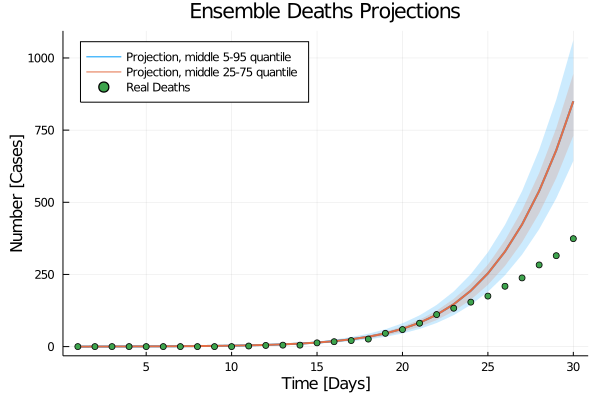
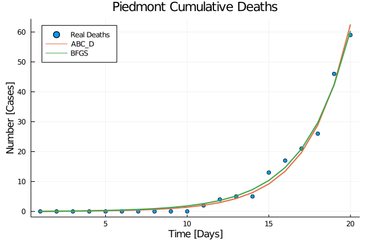
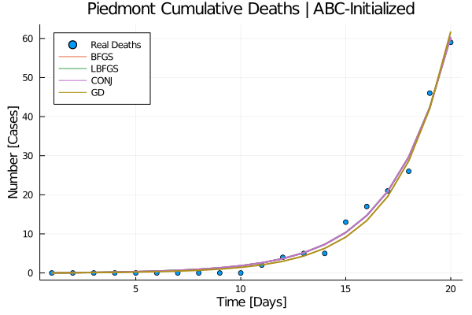
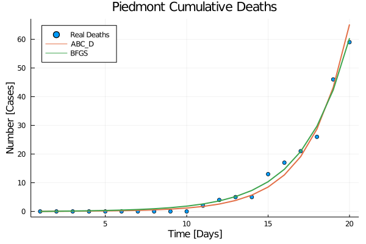
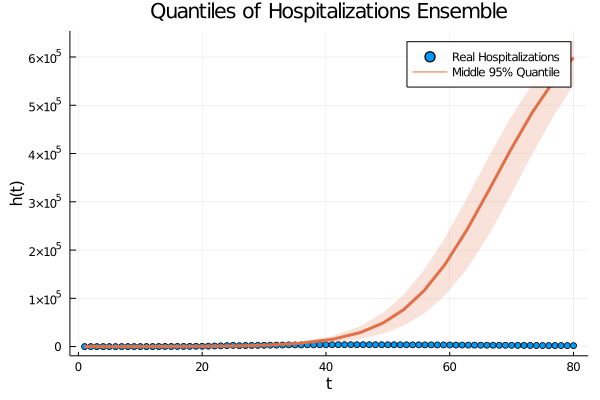
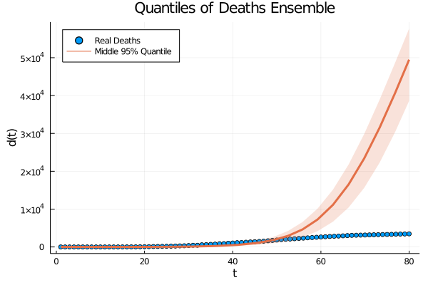
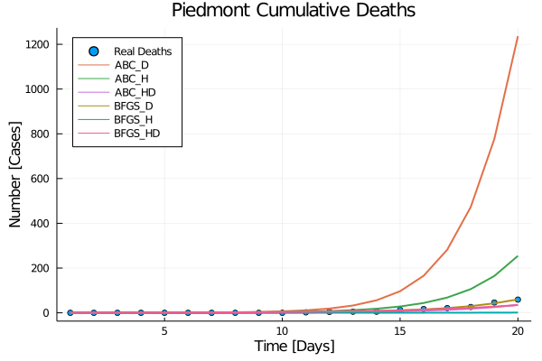
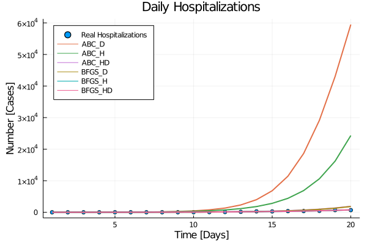
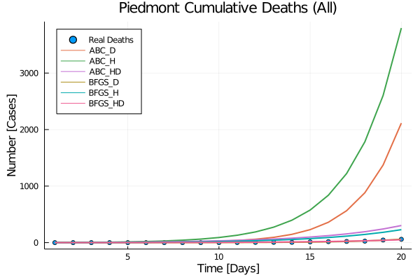
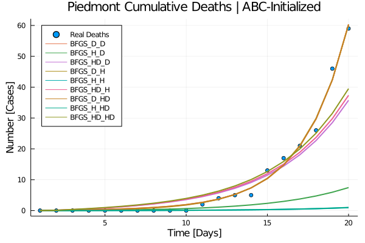

```{r setup, include=FALSE}
knitr::opts_chunk$set(message = FALSE, warning = FALSE, include = FALSE, eval = FALSE) 
library(DT)
library(knitr)
library(tidyverse)
```

name: overview
class: center 

# Overview 

.left[.small[

.pull-left[
### 1. **Data**

* [*Population*](#population)

* [*Contact*](#contact)

* [*Behavior*](#behavior)

* [*Surveillance*](#surveillance)

### 2. **Models**

* [*S-I-R-D*](#SIRD)

* [*S-E-I-R-D*](#SEIRD)

* [*S-I-H-R-D*](#SIHRD)

* [*S-E-I-H-R-D*](#SEIHRD)

* [*Transmission Model Selection*](#transmission)

]

.pull-right[
### 3. **Questions**

* [*News about Piedmont data*](#news-data) 

* [*Correction and projection of contact matrices*](#questions)

* [*Multi-phase calibration*](#questions)

* [*Initial conditions problem*](#questions)

* [*Time windows for calibration*](#questions)

* [*Behavior matrix calibration*](#questions)

* [*Portfolio of scenarios*](#questions)

* [*Inter-provincial mobility network-based meta-population*](#questions)

]
]
]
---
name: population
class: center 

## Population Data   

.pull-left[
### National 

]

.pull-right[
### Regional 

]


.footnote[
.left[.small[**Source**: [ISTAT (2020)](http://demo.istat.it/pop2020/index_e.html)]]
]

---
name: contact
class: center 

## Contact Data   

.pull-left[
### National 
.pull-left[


]
.pull-right[


]

]

.pull-right[
### Regional (M0)

.pull-left[


]
.pull-right[


]
]

.footnote[
.left[.small[**Sources**: [Prem et al. (2020)](https://doi.org/10.1101/2020.07.22.20159772) , [Arregui et al. (2018)](https://doi.org/10.1371/journal.pcbi.1006638)]]
]
---
name: contact-M1
class: center 

## Contact Data   

.pull-left[
### National 
.pull-left[


]
.pull-right[


]

]

.pull-right[
### Regional (M1)

.pull-left[


]
.pull-right[


]
]

.footnote[
.left[.small[**Sources**: [Prem et al. (2020)](https://doi.org/10.1101/2020.07.22.20159772) , [Arregui et al. (2018)](https://doi.org/10.1371/journal.pcbi.1006638)]]
]
---
name: contact-M2
class: center 

## Contact Data   

.pull-left[
### National 
.pull-left[


]
.pull-right[


]

]

.pull-right[
### Regional (M2)

.pull-left[


]
.pull-right[


]
]

.footnote[
.left[.small[**Sources**: [Prem et al. (2020)](https://doi.org/10.1101/2020.07.22.20159772) , [Arregui et al. (2018)](https://doi.org/10.1371/journal.pcbi.1006638)]]
]
---
name: contact-M3
class: center 

## Contact Data   

.pull-left[
### National 
.pull-left[


]
.pull-right[


]

]

.pull-right[
### Regional (M3)

.pull-left[


]
.pull-right[


]
]

.footnote[
.left[.small[**Sources**: [Prem et al. (2020)](https://doi.org/10.1101/2020.07.22.20159772) , [Arregui et al. (2018)](https://doi.org/10.1371/journal.pcbi.1006638)]]
]

---
name: projection-method-selection
class: center 

## Projection Method Selection

<br>

| **Method**| *Additivity* | *Reciprocity* | *Intrinsic Connectivity* | *Mean Connectivity* |
| :------: | :------: | :------: | :------: | :------: |
| M0 | ✓ | ✗ | ✗ | ✗ |
| M1 | ✓ | ✓ | ✗ | ✗ |
| **M2** | **✓** | **✓** | **✓**  | **✗** |
| M3 | ✗ | ✓ | ✓*| ✓ |

<br>

Imposing conservation of *intrinsic connectivity* on **M3** <br> $\Leftrightarrow$ <br> Imposing conservation of *mean connectivity* on **M2**.

.footnote[
.left[.small[✓*: preserved up to a global factor.

**Sources**: [Arregui et al. (2018)](https://doi.org/10.1371/journal.pcbi.1006638)
]]
]

---
name: behavior
class: center 

## Behavioral Changes 

.pull-left[

]

.pull-right[

]

.footnote[
.left[.small[
**NB**: The lockdown contact matrix above comes from a SEIRD model calibrated on reported deaths.
]]
]
---
name: surveillance
class: center 

## Surveillance Data   

.pull-left[
### National 
.pull-left[


]
.pull-right[


]

]

.pull-right[
### Regional 

.pull-left[


]
.pull-right[


]
]

.footnote[
.left[.small[**Sources**: [PCM-DPC (2020)](https://github.com/pcm-dpc/COVID-19) , [ISTAT (2020)](https://www.istat.it/it/archivio/240401)]]
]

---
name: SIRD
class: center 

## S-I-R-D Model  

.small[
.pull-left[

$$\begin{cases}
\Lambda_i = \beta \sum_{j} C_{ij}\frac{I_j}{N_j} \\
\dot{S} = - \Lambda S \\
\dot{I} = \Lambda S - [(1-\delta) \lambda_r + \delta \lambda_d] I \\
\dot{R} = (1- \delta)\lambda_r I  \\
\dot{D} = \delta \lambda_d I 
\end{cases}$$

<br><br><br><br><br>


]

.pull-right[


]]
---
name: SEIRD
class: center 

## S-E-I-R-D Model  
.small[
.pull-left[

$$\begin{cases}
\Lambda_i = \beta \sum_{j} C_{ij}\frac{I_j}{N_j} \\
\dot{S} = - \Lambda S \\
\dot{E} = \Lambda S - \epsilon E \\
\dot{I} = \epsilon E - [(1-\delta) \lambda_r + \delta \lambda_d] I \\
\dot{R} = (1- \delta)\lambda_r I  \\
\dot{D} = \delta \lambda_d I 
\end{cases}$$
]

.pull-right[



]]
---
name: SEIaIsRD
class: center 

## S-E-Ia-Is-R-D Model  
.small[
.pull-left[

$$\begin{cases}
\Lambda_i = \sum_{j} C_{ij}\frac{\beta_a I_{a_{j}}+\beta_s I_{s_{j}}}{N_j} \\
\dot{S} = - \Lambda S \\
\dot{E} = \Lambda S - \epsilon E \\
\dot{I_a} = \epsilon (1-\sigma) E - \lambda_r I_a \\
\dot{I_s} = \epsilon \sigma E - [(1-\delta) \lambda_r + \delta \lambda_d] I_s \\
\dot{R} = \lambda_r [(1- \delta) I_s + I_a] \\
\dot{D} = \delta \lambda_d I_s
\end{cases}$$

]

.pull-right[




]
]
---
name: SEIpIaIsRD
class: center 

## S-E-Ip-Ia-Is-R-D Model  
.small[
.pull-left[

$$\begin{cases}
\Lambda_i = \sum_{j} C_{ij} \frac{\beta_p I_{p_{j}}+\beta_a I_{a_{j}}+\beta_s I_{s_{j}}}{N_j} \\
\dot{S} = - \Lambda S \\
\dot{E} = \Lambda S - E \\
\dot{I_p} = \sigma E - \epsilon I_p \\
\dot{I_a} = (1-\sigma) E - \lambda_{a,r} I_a \\
\dot{I_s} = \epsilon I_p - [(1-\delta) \lambda_{s,r} + \delta \lambda_d] I_s \\
\dot{R} = \lambda_{s,r}(1- \delta) I_s + \lambda_{a,r} I_a \\
\dot{D} = \delta \lambda_d I_s 
\end{cases}$$

]

.pull-right[


]
]
---
name: SIHRD
class: center 

## S-I-H-R-D Model  
.small[
.pull-left[

$$\begin{cases}
\Lambda_i = \beta \sum_{j} C_{ij}\frac{I_j}{N_j} \\
\dot{S} = - \Lambda S \\
\dot{I} = \Lambda S - [(1-\eta) \lambda_{i,r} + \eta \lambda_{h}] I \\
\dot{H} = \eta\lambda_{h} I - [(1-\delta) \lambda_{h,r} + \delta \lambda_{d}] H \\
\dot{R} = (1-\delta)\lambda_{h,r} H +(1-\eta)\lambda_{i,r} I  \\
\dot{D} = \delta \lambda_d H
\end{cases}$$
<br><br><br><br>


]

.pull-right[


<br><br><br><br><br><br>


]
]

---
name: SEIHRD
class: center 

## S-E-I-H-R-D Model  
.small[
.pull-left[

$$\begin{cases}
\Lambda_i = \beta \sum_{j} C_{ij}\frac{I_j}{N_j} \\
\dot{S} = - \Lambda S \\
\dot{E} = \Lambda S - \epsilon E \\
\dot{I} = \epsilon E - [(1-\eta) \lambda_{i,r} + \eta \lambda_{h}] I \\
\dot{H} = \eta\lambda_{h} I - [(1-\delta) \lambda_{h,r} + \delta \lambda_{d}] H \\
\dot{R} = (1-\delta)\lambda_{h,r} H +(1-\eta)\lambda_{i,r} I  \\
\dot{D} = \delta \lambda_d H
\end{cases}$$

<br><br><br>


]

.pull-right[
.pull-left[







]
.pull-right[



]
]
]

---
name: SEIpIaIsQHICURD
class: center 

## Transmission Model Selection  

<br><br> 


---

name: questions
class: center 

# Questions

.left[

#### News about Piedmont data

#### Correction and projection of contact matrices

#### Multi-phase calibration

#### Initial conditions problem

#### Time windows for calibration

#### Behavior matrix calibration

#### Portfolio of scenarios

#### Inter-provincial mobility network-based meta-population
]