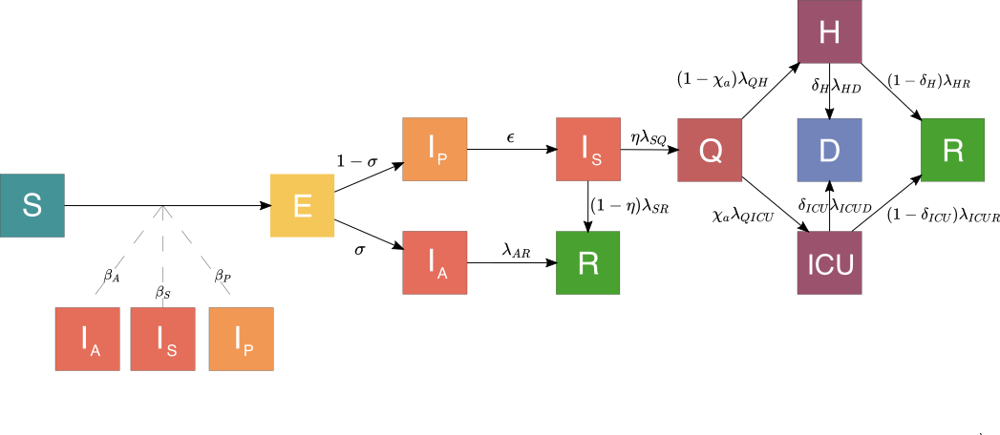

```{r setup, include=FALSE}
knitr::opts_chunk$set(message = FALSE, warning = FALSE, include = FALSE, eval = FALSE) 
library(DT)
library(knitr)
library(tidyverse)
```

## Obiettivo {#goal}

Il nostro progetto di ricerca consiste nello sviluppo di un modello equation-based che descriva accuratamente la dinamica di diffusione di COVID-19 sul territorio piemontese al fine di valutare l'impatto di potenziali interventi di sanità pubblica e modifiche comportamentali della popolazione sul controllo della trasmissione del virus.

## Modello {#model}

Il modello consiste in un equation-based, multi-livello, strutturato per età e sintomatologia aggiornato agli ultimi report clinici ed epidemiologici su SARS-CoV-2.

Nel seguente diagramma compartimentale che illustra schematicamente la storia naturale di COVID-19. 



Elenchiamo brevemente il significato di ciascuno dei compartimenti caratterizzanti gli stati clinici e d'infezione strutturati per età tipici della malattia infettiva in questione: 

* $S$: suscettibili;
* $E$: esposti / latenti (infetti, ma non infettivi);
* $I_P$: infettivi presintomatici;
* $I_A$: infettivi asintomatici; 
* $I_S$: infettivi sintomatici; 
* $Q$: isolati / quarantenati;
* $H$: ospedalizzati;
* $ICU$: critici / in terapia intensiva;
* $R$: dimessi / guariti definitivamente;
* $D$: deceduti. 

## Dati {#data}

I dati epidemiologicamente rilevanti di cui disponiamo sono quelli che il [Dipartimento di Protezione Civile](https://github.com/pcm-dpc/COVID-19) pubblica quotidianamente. L'accuratezza e la risoluzione di questi ultimi limitano notevolmente la possibilità di calibrare opportunamente i modelli con i quali si effettuano previsioni che siano al contempo precise e affidabili. 

Pertanto, per raggiungere la robustezza desiderata, necessitiamo delle seguenti serie temporali stratificate per età:

* Casi sintomatici per data di inizio sintomi e di diagnosi / prelievo ($I_S$);
* Casi isolati / quarantenati per data di inizio quarantena e di diagnosi / prelievo ($Q$);
* Casi ospedalizzati per data di ammissione  ($H$);
* Casi in terapia intensiva per data di ammissione  ($ICU$);
* Casi dimessi / guariti per data di dimissione ($R$);
* Casi deceduti per data di decesso ($D$).


